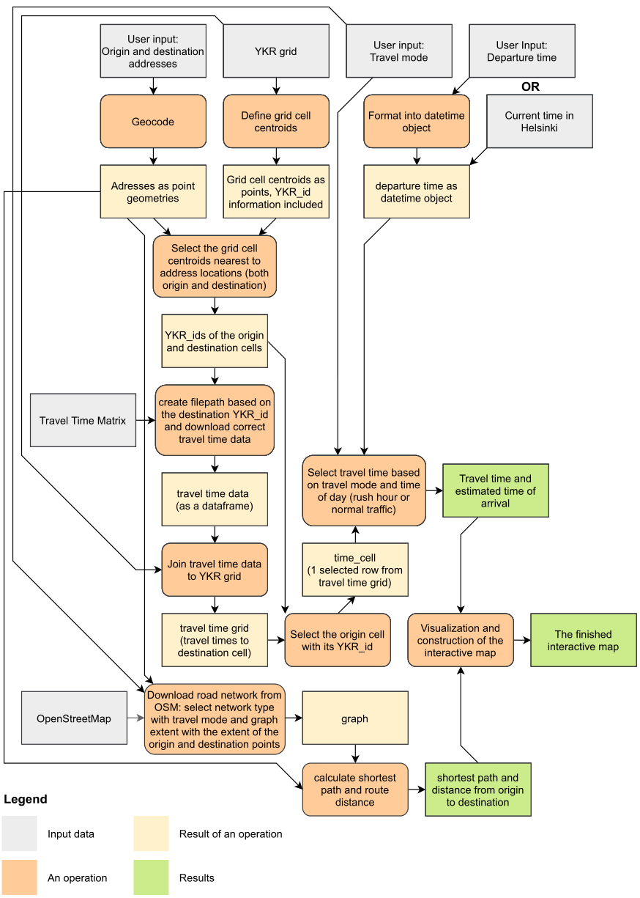

# Final Assignment

### Status

Once you are finished with the final assignment, edit this readme and add "x" to the correct box:

* [x] Submitted

* [ ] I'm still working on my final assignment. 

## Topic: AccessViz
My final assignment is a routing tool that operates based on user input. The user inputs the adresses of the origin and destination of the route, the travel mode and the time of departure. The tool can also automatically select current time in Helsinki as departure time. With the input information the tool calculates the travel time between the origin and destination, the estimated time of arrival and the shortest path.

The tool uses the Helsinki Region Travel Time Matrix as a basis for the travel time calculations. Based on the addresses the tool selects and downloads the correct travel time matrix files, and based on the travel mode input it selects the correct travel mode-spesified travel time from the matrix. The tool also takes the rush hours into account: if the departure time is within the rush hour and the selected travel mode is affected by road traffic the tool selects the rush hour variant of the travel time.

The shortest path calculation uses street network data from OpenStreetMap. The network extent used in the analysis is based on the locations of the addresses and the type of network depends on the user-defined travel mode.

The tool displays the resulting route and its information as an interactive map.

In theory this tool could work with any address pair in the Helsinki region. However, to achieve this the complete travel time matrix (with its 13 231 different files) would be needed. To keep my repository size reasonable, I chose to only upload the data of the travel times to the grid cells that contain univeristy of Helsinki campuses. With this limitation the tool takes any address that is within the travel time matrix area as origin address, but can only use 4 different addresses (the university campuses) as destinations. 

### Structure of this repository:
All of the code is found in the **Final_exercise.ipynb** notebook. Data is in the **data** folder, which has 2 subfolders: **traveltimes** for the travel time data and **YKR** for the YKR grid data. There's also a separate **img** folder for the workflow chart I used to describe the analysis steps and a **map** folder for the finished interactive map (with an example map included).

### Input data:
- The Helsinki Region Travel Time Matrix, available at: https://blogs.helsinki.fi/accessibility/helsinki-region-travel-time-matrix/
- The YKR grid, available at: https://blogs.helsinki.fi/accessibility/helsinki-region-travel-time-matrix/
- OpenStreetMap data fetched with OSMnx
- User input

### Analysis steps:
The analysis steps are covered in the workflow chart below:

### Results:
The tool displays the shortest route from the origin address to the destination address on an interactive map. The map shows details about the origin, destination and the route.

### References:
Here are some resources I found helful (somewhat arranged in the order of importance for me):

- Probably the most helpful resource was the course website: https://autogis-site.readthedocs.io/en/latest/
- Metadata of the input files (especially the travel time matrix)
- GeoPandas documentation: https://geopandas.org/
- Folium documentation: https://python-visualization.github.io/folium/
- Python datetime calculations: https://docs.python.org/3/library/datetime.html
- OSMnx documentation: https://osmnx.readthedocs.io/en/stable/osmnx.html
- Python operators: https://www.w3schools.com/python/python_operators.asp
- String replacement syntax: https://www.w3schools.com/python/ref_string_replace.asp
- And countless stack overflow threads
